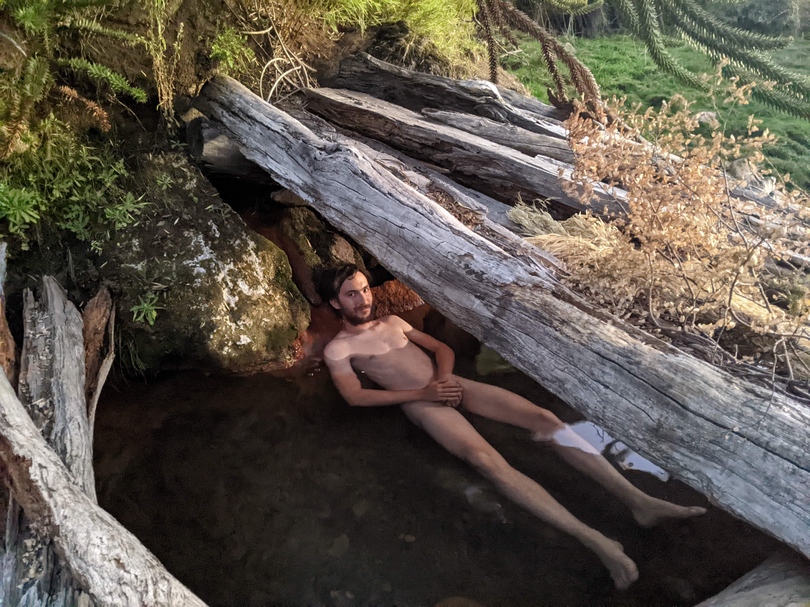
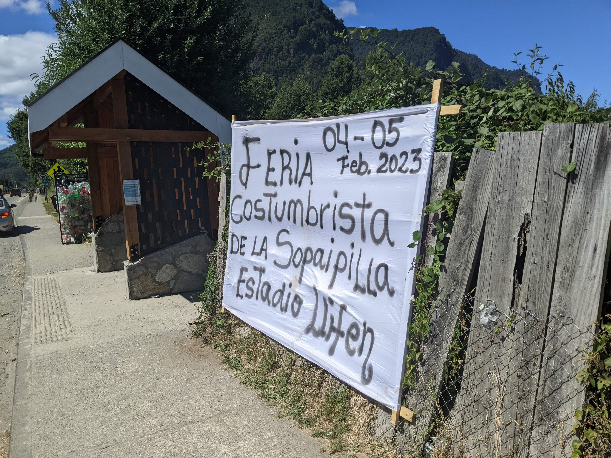

# Joys & Pains

!!! info "Note"

    Our hike on the GPT was filled with amazing moments, beautiful encounters and some annoying bits. In this page, we will not be exhaustive, but try to highlight some of our best and worst moments.

## The best moments

### Climbing volcanos

The route of the GPT allows for several options to climb volcanos. This is quite a unique experience and usually only a moderate detour. We climbed 5 of them :

* Puyehue (GPT19)
* Quetrupillan (GPT16)
* Antuco (GPT09)
* Chillan (GPT08)
* Descabezado Grande (GPT06)

Every ascent was divided in three moments :

1. __The pain__: Going up is  most of the time in sand or scree that does not hold and it is really demanding. Sometimes, we felt lucky to find a firm snow patch to use, but usually they are no shortcut.
1. __The joy__: When reaching the summit, there is an amazing view on the crateer, something you can only have at the top. That is the reward! And all 5 of them were really different (rocky, with snow, ice spikes...). Plus, we enjoyed the views at 360 over the surrounding landscapes.
2. __The fun__: While going up is demanding, going down is usually super fun. The more it was a struggle to go up, the easier is the descent. Most of the time, you can run in the sand with little effort. As an example, it took us 6 hours to go up Descabezado but only 1:30 to go down.

As a summary, we loved our volcanos climb, and they were some of the best moments of our GPT experience.

### The (natural) hot springs

<figure markdown>
  { loading=lazy width=60% data-gallery="good"}
    <figcaption>Alexis relaxing at Banos Coyucos</figcaption>
</figure>

Along the way, we encountered several spots with hot water in the nature (GPT19, GPT12, GPT08, GPT06...). Due to their remote nature, we were often alone there (or with just a few other people). They allowed for nice hot baths and relaxing moments after long day of hikes.

### Sopaipillas

<figure markdown>
  { loading=lazy width=25.2% data-gallery="good"}
  { loading=lazy width=45% data-gallery="good"}
</figure>

Probably a gift from heavens to the mankind, this small breads fried in cow fat are one of the most delicious that exists. And the recipe is both extremely simple and very lenient to variations. We had the chance to learn how to bake them in Candelario Mancilla with Maria Luisa while waiting several days for our boat. We also by chance encountered a _Sopaipilla feria_ at the end of our GPT16, a perfect way to finish a section!

### Bonus : a kitten

<figure markdown>
  { loading=lazy width=45% data-gallery="good"}
  <figcaption>Harina</figcaption>
</figure>

Because an internet website without a kitten picture is not complete, here is a picture of __Harina__, a kitten that helped us wait a few day for our boat in Candelario Mancilla. She was extremely cute, and super young! And we were there for her first time in the outside world (the front of her house, but still!).

## The annoying bits

### (Wild) Cows

As silly as it may sound, a cow herd can be really scarry. They are the main inhabitants of the land we traverse, and you are trepassing on their property. While most of them are really chill, we also had some scarry encounters. During GPT08, we passed near a cheptel of cow but they decided to passively aggressively follow us, first at a safe distance, but then, reducing it a bit and even running towards us. This continued for about 2 km, and we think we never walked that fast during our hike. Luckily, they stopped at some point, allowing us to rest a bit.

### Tabanos

While cows are big and scarry, tabaños are smaller but much more annoying. If you are unlucky with the weather (meaning, it is a windless and sunny day) and you are hiking during their season (January/February), then you will encounter them. They fly around you head, making this annoying sound. And when they finally stop, it is because they are on you, ready to bite you. And it hurt! The worst part is that there are no good solutions against them. When meeting Jan, it simply told us that tabaños were less annoying than mosquitos.

Our strategy to deal with them was:

- For days with few of them, simply kill them as soon as you ear them. We developped a technique with both of us, and hit ourselves pretty hard (they love to land on the head).
- For days with overwhelming numbers, we simply waited until it was unbereable (about 15/20 around each of us) and started our __rampage__. We stopped and try to kill all of them.

Having clothes with brighter colors seems to help. Iris rain cover was green and they seemed to ignore it while Alexis' was black and attracting them.

### Wasps

After the end of the tabaños season, we were relieved. Until we got to the part where they were replaced by wasps. At some points, they were so many that we were overwhelmed by a _buzz_ sound made by thousands of wasps. Luckily for us, wasps were not aggressive, and we simply had to make sure to not step on them. We simply got stung once, and that was Alexis fault because he did not see the wasp when removing the skins of piñones[^1].

Nonetheless, it was not a pleasant experience to see that many of them.

### Spikes

<figure markdown>
  { loading=lazy width=30% data-gallery="annoying"}
  { loading=lazy width=30% data-gallery="annoying"}
</figure>

They are tiny, and you often don't really see them. But at the end of the day, you have numerous in your clothes (shoes, gaiters and pants). And they are annoying to remove because they are sharp. We encountered them in every section... and I guess, you just have to deal with them. Luckily, our pants were strong enough so removing them did not destroy them, but the gaiters suffered a bigger hit.

[^1]: Alexis got even more lucky because fortunately a doctor with the appropriate drugs to stop the reaction was there.