# Food

The food on the trail was a really important topic for us, and the one we learned the most during our hike. Indeed, we started with really low calories rations and ended up being hungry almost all the time and losing lot of weight in the first few weeks. Following [Piia and Oliver](https://www.nothingtwowrite.com/)[^1] example, we started to count calories and did our groceries with this food-math in mind. This was a bit complicated at first, but then, we developed sort of a habit and at the end, we knew the ballparks numbers of calories/100g of many of our typical food items.

[^1]: A couple of GPT-hikers that hiked the GPT during the 2016-2017 season.

## Calories count
Our menus were trying to reach :

* 2,800 kcal/day for Alexis
* 2,100 kcal/day for Iris

## Meals schedule

A typical day on the trail was with 5 meals every 2h/2h30:

* Breakfast - hot or cold ;
* Morning Snack - cold ;
* Lunch - cold ;
* Afternoon snack - cold ;
* Dinner - hot.

## Trail menu

### Breakfast

<figure markdown>
  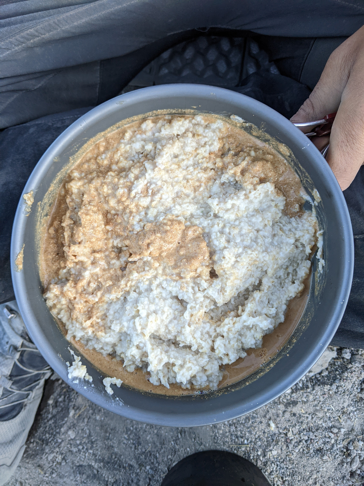{ loading=lazy width=45% data-gallery="food"}
  <figcaption>A delicious hot breakfast with oatmeal, dehydrated soup and harina tostada.</figcaption>
</figure>

* **When**: just before leaving, after packing everything.
* **What**: We had two different types:
    * Instant oatmeal with dehydrated soup (chicken was the favorite) slightly cooked.
    * Museli with milo (powder cacao) and cold water or powder milk.
* **Alexis' bonus**: Harina tostada with cinamon.
* **Calorie count**:
    * Alexis: 530
    * Iris: 330

### Morning Snack

<figure markdown>
  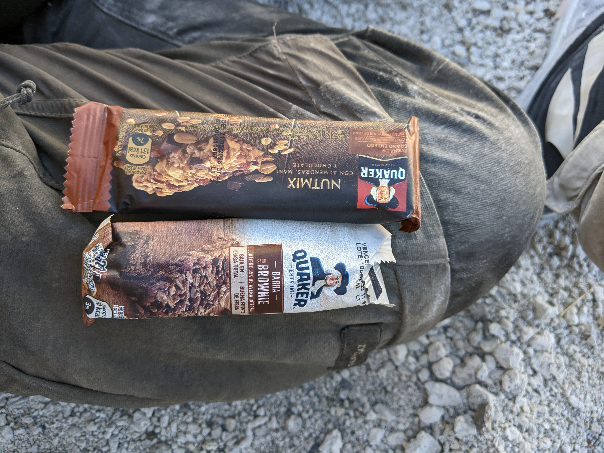{ loading=lazy width=45% data-gallery="food"}
  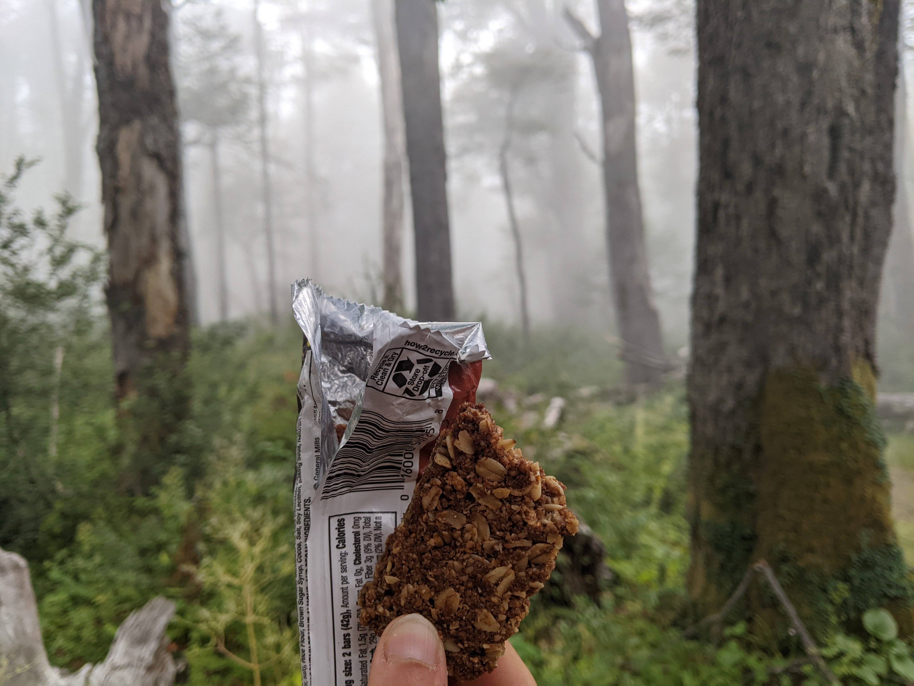{ loading=lazy width=45% data-gallery="food"}
</figure>

* **When**: Usually after 2h/2h30 of walking or when one of us was feeling hungry
* **What**: Cereals bars. There are multiple types in Chile, but it is hard to always find the same ones. Our favorite were the NatureValley, but we also loved Soul and Protein. However, the most available ones were the Quakers, not super tasty. To reach the expected calories count, sometimes we had to take 2 or 3 bars for a single break.
* **Alexis' bonus**: None.
* **Calorie count**:
    * Alexis: 200
    * Iris: 200

### Lunch

<figure markdown>
  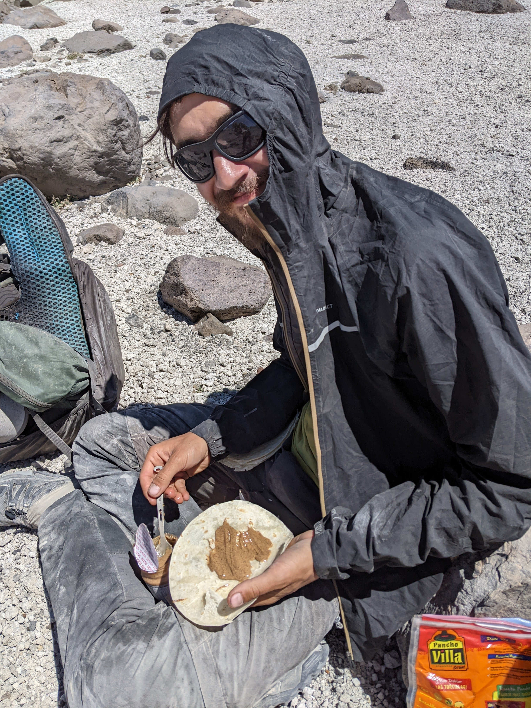{ loading=lazy width=18.6% data-gallery="food"}
  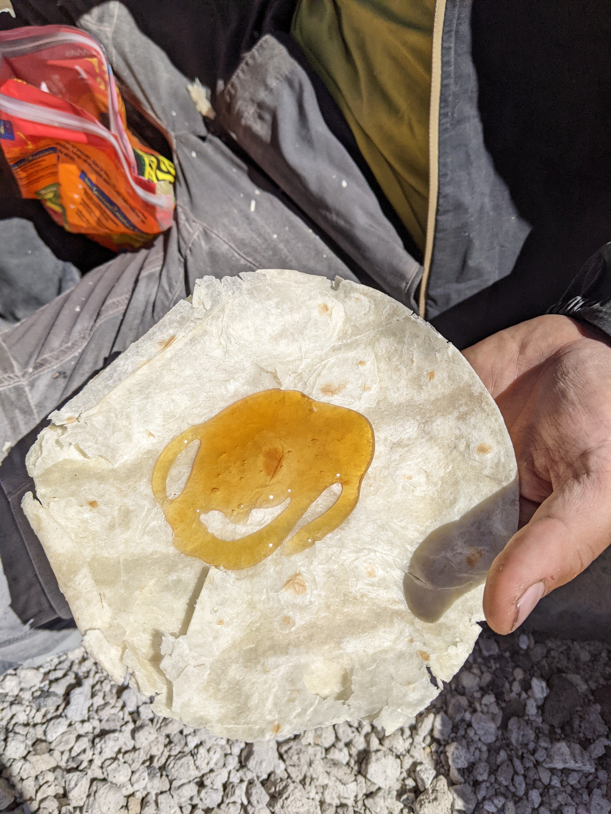{ loading=lazy width=18.6% data-gallery="food"}
</figure>

* **When**: Between 12 and 14, usually 2-2h30 after the snack.
* **What**: 
    * One tortilla with a spoon of peanut butter
    * One tortilla with a spoon of chocolate/chestnut/honey spread
* **Alexis' bonus**: Another tortilla with peanut butter
* **Calorie count**: 
    * Alexis: 700
    * Iris: 510

### Afternoon Snack

<figure markdown>
  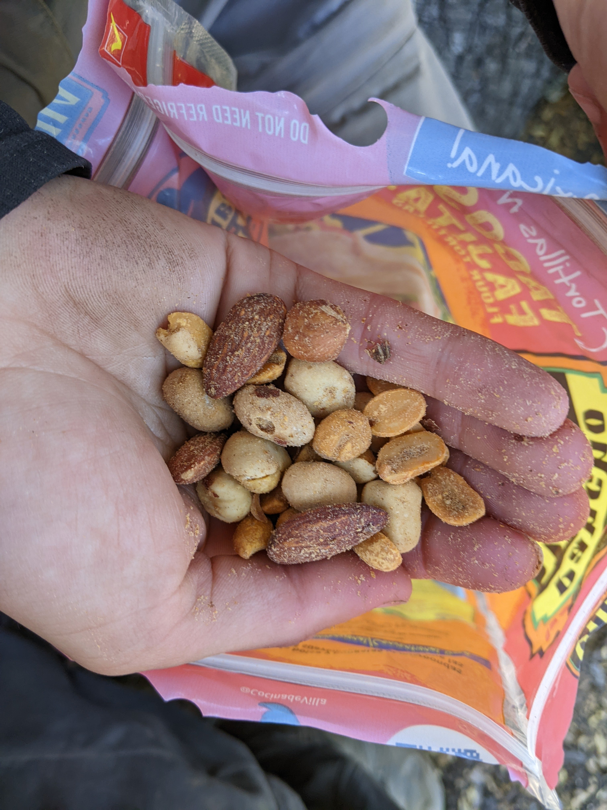{ loading=lazy width=45% data-gallery="food"}
</figure>

* **When**: In the middle of the afternoon. For shorter hiking day, this was skipped.
* **What**: Homemade trail mix. Our best combination was:
    - Peanuts with merken
    - Japanese peanuts
    - Chestnuts
    - Almonds
* **Alexis' bonus**: Spéculoos or kit kat
* **Calorie count**: 
    * Alexis: 460
    * Iris: 250

### Dinner

<figure markdown>
  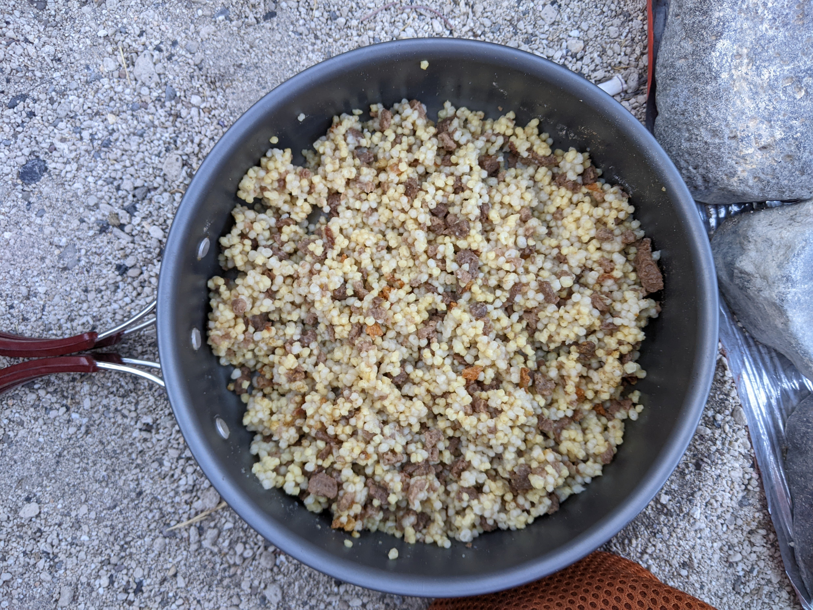{ loading=lazy width=60% data-gallery="food"}
  <figcaption markdown>A plate with quinoa and _carne de soya_</figcaption>
</figure>

* **When**: Before going to sleep.
* **What**: We alternated between few different options.  
    * *Puree de papas* with dehydrated soup
    * Polenta with spices or dehydrated soup
    * Semola with spices or dehydrated soup
    
    We always added soy meat (_carne de soja_) for proteins and often crispy onions for the taste.
    Finally, a desert (usually a cookie)!

* **Alexis' bonus**: Extra ration of soy meat.
* **Calorie count**: 
    * Alexis: 950
    * Iris: 850

## Extras

For shorter sections (like 19 or 16), we also carried vegetables to improve our daily meals (such as carrots for the tortillas, or avocados for the breakfast). A fresh version (but with less calories) of the lunch break was a tortilla with boiled eggs, carrots, red cabbage and hummus.

Our regime lacked some vitamins, so we also took some supplements to limit our carences. And in towns, we would often buy lot of vegetables and eat big salads to compensate.

## Harvesting food

<figure markdown>
  { loading=lazy width=24% data-gallery="food"}
  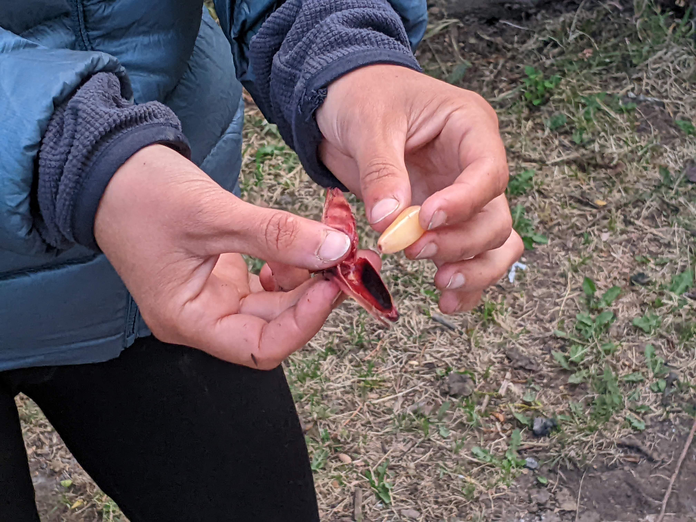{ loading=lazy width=24% data-gallery="food"}
  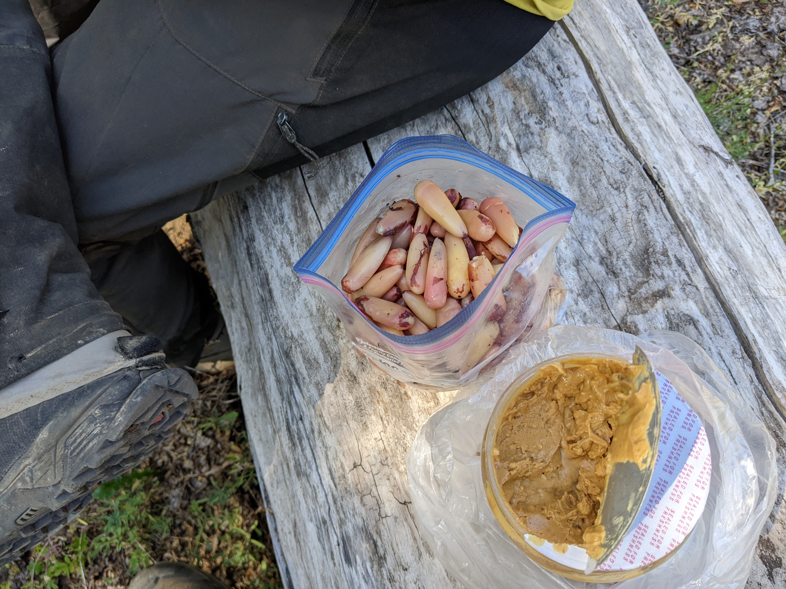{ loading=lazy width=24% data-gallery="food"}
  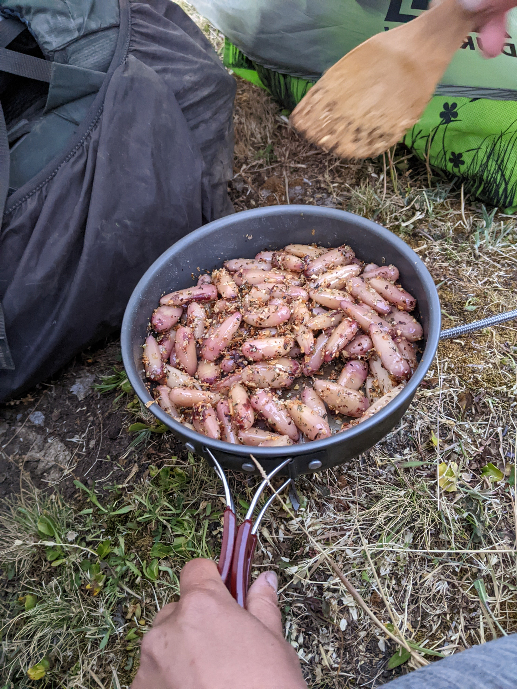{ loading=lazy width=13.6% data-gallery="food"}
    <figcaption>Dealing with piñones</figcaption>
</figure>

Jan explains the food you can find on trail better in the manual. For our part, we managed to harvest food on the trail, either directly from the nature, or simply by buying it to the locals. The sweet fruits of the fuschia made refreshing little snacks, calafate berries a more stringent snack, and blackberries a binge snack. We were also spoiled because we hiked in the Araucania region when the piñones were ripe, and ate plenty of those (we cooked them in open fires to save our gas). This allowed us to extend our reserves, and to do the 12-9 stretch in one go.

<figure markdown>
  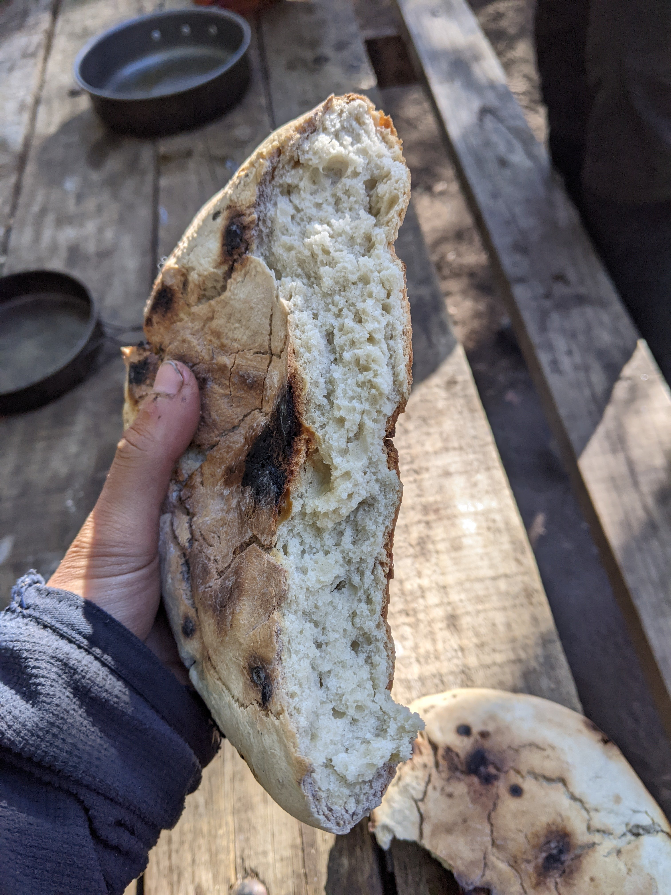{ loading=lazy width=45% data-gallery="food"}
  <figcaption>A tortilla rescalda: a heavy but nutritious meal</figcaption>
</figure>

It is also possible to sometimes buy food on the trail to extend even further the reserves. For example, we were able to buy 5 _tortillas rescalda_ at the camping near Lago Desierto that lasted for days (one could easily serve as a lunch for 2).

## Spices

To improve our meals, we usually carried some spices:

* Salt ;
* Pepper ;
* Curry ;
* Merken[^2];
* Garlic (_powder_) ;
* Parmesan (_sold in bag of 40 or 80 g in every supermarket_);
* Cinnamon.

Along our olive oil, this allowed to make every meal a bit tastier!

## Groceries repackaging

<figure markdown>
  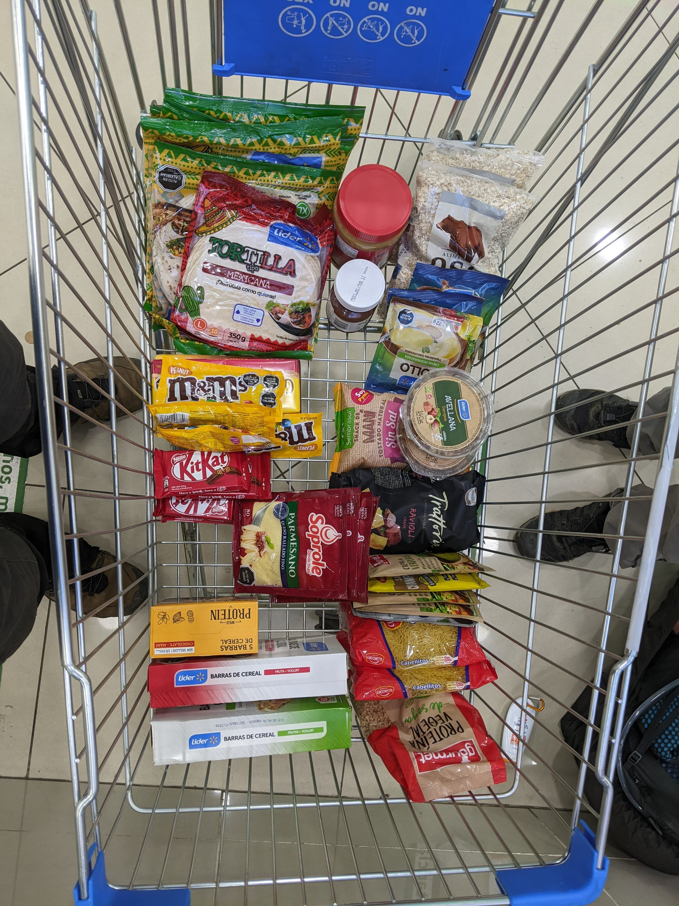{ loading=lazy width=25.2% data-gallery="food"}
  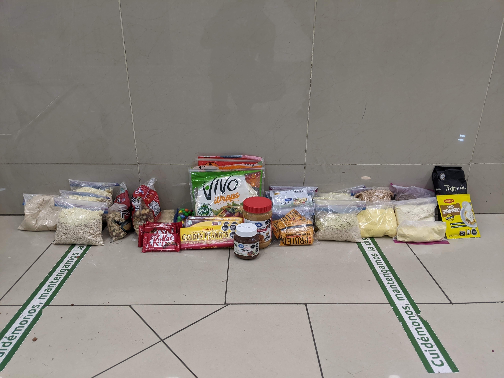{ loading=lazy width=45% data-gallery="food"}
</figure>

To avoid carrying useless (and sometimes relatively heavy) packages, we always used a repackaging step with ziplocks. This allowed us to minimize the garbages we had during the hike and for the food to fit in our bags. We also used extensively the tortillas bags as bigger containers for many items.

[^2]: A delicious smoked red pepper.

## Weight loss

Even with the improved calorie count, we both experienced some heavy weight loss. Indeed, going from a sedentary lifestyle as full-time hikers, we increased our physical activity by quite a lot. For example, Alexis lost a bit more of 12 kg in the first two months of hiking and Iris almost 6kg.
