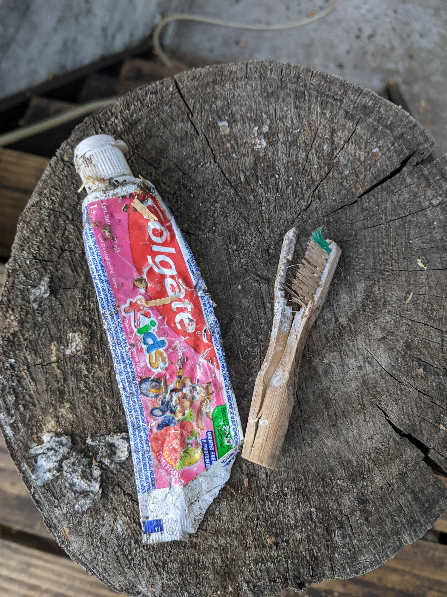
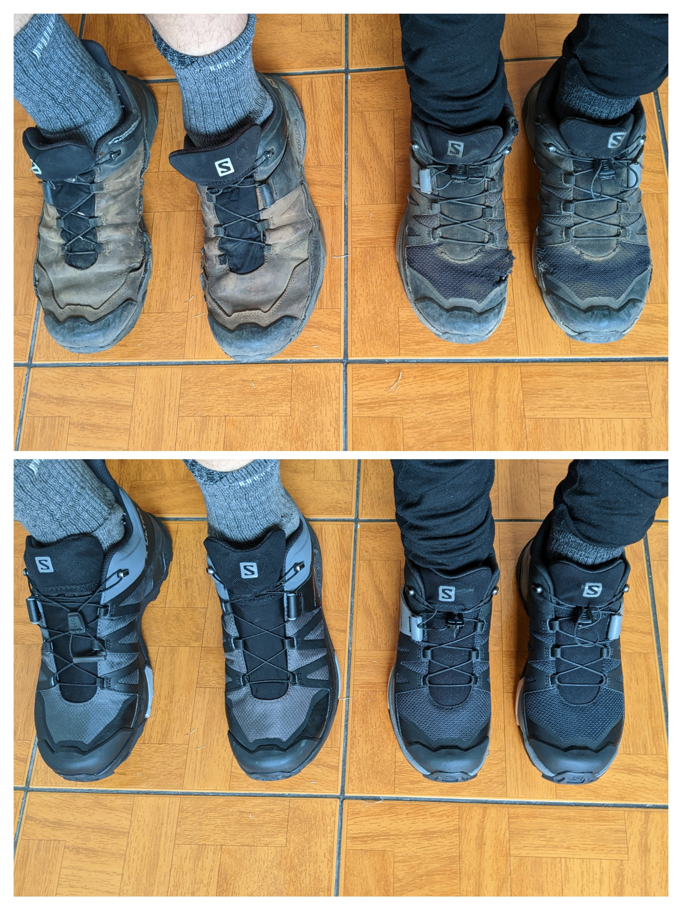

# Gear

!!! danger "Disclamer"

    The following page lists the content of our bags. We are neither affiliated nor endorsing the items we used.

## Preparation

Filling our bags was a big part of our preparation for the GPT. During thru-hikes any item in the backpack need to be carried until the end. Hence, every gram counted and we aimed for light backpacks. We extensively used the french forum [randonnee-leger](https://www.randonner-leger.org/forum/), an online community of ultra light backpackers. While they sometimes make choices we were not ready to do, the forum is an information goldmine on light gear.

We did test our gear in November 2022 before our departure by doing a two days hike in the Fontainebleau forest with friends. Even a short hike like this one helped us to learn a lot on our gear, and adjusted our backpacks afterwards (e.g. we changed the sleeping pads for warmer ones).

## Initial list

??? info "Click to expand"

    === "Alexis"
        
        | Item        | Description                                        | Weight (g) |
        | :--------:  | :----------        ------------------------------- | :--------- |
        | **Carry** {: colspan=3 }         | &#8288 {: style="padding:0" } | &#8288 {: style="padding:0" } |
        | Backpack    | Gregory Focal 48                        | 1180|
        | Rain cover  | Gregory                                 | 108 |
        | Day Pack    | Playking Lightweight Backpack           | 83  |
        | **Hiking** {: colspan=3 }         | &#8288 {: style="padding:0" }| &#8288 {: style="padding:0" } |
        | Trek poles  | Bedee                                   | 552 |
        | Shoes       | Salomon X Ultra 04 GTX                  | 846 |
        | Gaiters     | Altra Trail Zero Limit                  | 30  |
        | Hat         | Sunday Ultra Adventure Hat              | 78  |
        | Cap         | Decathlon Merino MT500                  | 28  |
        | Gloves      | Decathlon MT100                         | 39  |
        | Rain gloves | Decathlon MT500                         | 45  |
        | Glasses     | Decathlon MH500                         | 28  |
        | Glasses case| DIY                                     | 8   |
        | Rainjacket  | Evadict Rainjacket Bronze               | 221 |
        | **Day clothes** {: colspan=3 }         | &#8288 {: style="padding:0" } | &#8288 {: style="padding:0" } |
        | Pant        | Decathlon MT100                         | 437 |
        | Tee shirt   | Kiprun Skincare Noir                    | 98  |
        | Sweat       | Ternua Talok 1/2                        | 237 |
        | Socks       | Decathlon MH500                         | 61  |
        | Underwear   | Decathlon MT500 Merino                  | 72  |
        | Buff        | Decathlon MT500                         | 44  |
        | **Night clothes** {: colspan=3 }         | &#8288 {: style="padding:0" } | &#8288 {: style="padding:0" } |
        | Tee Shirt   | Patagonia Cool Capilene Merino          | 150 |
        | Puffy Jacket| SunValley Gustyn                        | 482 |
        | Socks       | Decathlon MH500                         | 61  |
        | Underwear   | NatureHike Boxer                        | 56  |
        | Pant        | IceBreaker Shifter Pant                 | 313 |
        | Shoes       | DIY Urarche vibram                      | 214 |
        | **Sleep** {: colspan=3 }         | &#8288 {: style="padding:0" } | &#8288 {: style="padding:0" } |
        | Duvet       | Valandre Mirage 3/4                     | 829 |
        | Pad         | Thermarest NeoAir XLite Medium          | 428 |
        | Tent        | Durston X-Mid 2P                        | 1115|
        | Footprint   | Emergency blanket                       | 90  |
        | Sleep Sheet | Noname in silk                          | 110 |
        | Pegs        | NatureHike V Shape                      | 70  |
        | Seatpad     | Decathlon MT500                         | 56  |
        | **Misc** {: colspan=3 }         | &#8288 {: style="padding:0" }  | &#8288 {: style="padding:0" } |
        | Repair kit  | Thermarest                              | 8   |
        | Tape        | Duck tape                               |  12 |
        | Pee Rag     | DIY Reusable cotton                     |  7  |
        | Rope        | ExtremTextil Dyneema 2mm                |  10 |
        | **Electronic** {: colspan=3 }         | &#8288 {: style="padding:0" }| &#8288 {: style="padding:0" } |
        | Phone       | Google Pixel 3                          | 189 |
        | Headlight   | Nitecore NU25 UL                        | 48  |
        | Ebook Reader| Kindle PaperWhite (Alexis)              | 185 |
        | Ebook Reader| Kindle PaperWhite (Iris)                | 185 |
        | Headphones  | Air Pod Pro 2                           |  63 |
        | Headphones  | Sony Linkbud                            | 42  |
        | GPS         | Garmin Etrex 32 X                       | 147 |
        | SOS         | Garmin inReach Mini                     | 102 |
        | Charger     | Anker Nano 521                          |  93 |
        | USB Cables  | USB C-C 30cm (*2)                       |  12 |
        | Adaptaters  | USB C - (MicroSD, MiniUSB, MagSafe)     |   6 |
        | **Administrative** {: colspan=3 }         | &#8288 {: style="padding:0" } | &#8288 {: style="padding:0" } |
        | Papers      | Passport + Driving license + Vaccination| 61  |
        | Wallet      | ZUOFILY Outdoor Waterproof Bag          | 9   |
        | **Food/Drink** {: colspan=3 }         | &#8288 {: style="padding:0" }| &#8288 {: style="padding:0" } |
        | Waterbag    | Decathlon 3L MT500                      | 129 |
        | Filter      | Sawyer MicroSqueeze                     | 106 |
        | Bottle      | Flexible Sawyer 32 oz                   | XXX |
        | Spork       | Lixada Titanium (*2)                    | 30  |
        | Knife       | Victorinox Ambassador                   |   35|
        | Heater      | FireMaple 117t                          |  108|
        | Pot         | Toaks 1300mL                            | 170 |
        | Bowls       | Tuna cans       (*2)                    |     |
    
        Base weight: 8300g
    
    === "Iris"
        
        | Item        | Description                                        | Weight (g)|
        | :---------: | :----------        --------------------------- | :----- |
        | **Carry** {: colspan=3 }         | &#8288 {: style="padding:0" } | &#8288 {: style="padding:0" }      |
        | Backpack        | Osprey Eja 48                         | 1290|
        | Rain cover      | Seatosummit Ultrasil day pack 18L     | 30  |
        | Day Pack        | Seatosummit Ultrasil packcover M      | 103 |
        | **Hiking** {: colspan=3 }         | &#8288 {: style="padding:0" }| &#8288 {: style="padding:0" }      |
        | Trek poles      | Bedee                                 | 552 |
        | Shoes           | Salomon X Ultra 04                    | 700 |
        | Gaiters         | Altra Trail Zero Limit                | 30  |
        | Hat             | Sunday Ultra Adventure Hat size SM    | 76  |
        | Cap             | GoSport Wanabee                       | 36  |
        | Gloves          | Decathlon MT100                       | 39  |
        | Rain gloves     | Decathlon MT500                       | 45  |
        | Glasses         | Decathlon MH530w pola cat 3           | 28  |
        | Rain Jacket     | Evadict Rainjacket Size S             | 210 |
        | **Day clothes** {: colspan=3 }         | &#8288 {: style="padding:0" } | &#8288 {: style="padding:0" }|
        | Pant            | Decathlon 14 years girl convertible   | 254 |
        | Tee shirt       | Princess TamTam heat tech long sleeves| 120 |
        | Sweat           | Millet polaire k light grid po w xs   | 190 |
        | Socks           | Sealskinz 4 seasons middle ankle      | 86  |
        | Underwear       | Icebreaker Panties Merino Size S      | 50  |
        | Buff            | Decathlon MT500                       | 44  |
        | **Night clothes** {: colspan=3 }         | &#8288 {: style="padding:0" }| &#8288 {: style="padding:0" } |
        | Tee Shirt       | Patagonia Cool Capilene Merino xs     | 113 |
        | Puffy jacket    | Uniqlo Ultralight with Hood           | 210 |
        | Socks           | Decathlon MH500                       | 61  |
        | Period underwear| Bertyne period panties                | 60  |
        | Pant            | Icebreaker Legging trek merino 260    | 260 |
        | Shoes           | DIY Urarche vibram                    | 214 |
        | **Sleep** {: colspan=3 }         | &#8288 {: style="padding:0" } | &#8288 {: style="padding:0" }      |
        | Sleeping Bag    | Seatosummit Trek II                   | 850 |
        | Pad             | Thermarest Neoair XLite W             | 360 |
        | Sleep Sheet     | Decathlon 100% Silk                   | 135 |
        | Seatpad         | Decathlon MT500                       | 56  |
        | **Misc** {: colspan=3 }         | &#8288 {: style="padding:0" }  | &#8288 {: style="padding:0" }      |
        | Pee Rag         | DIY Reusable cotton                   |  7  |
        | **Electronic** {: colspan=3 }| &#8288 {: style="padding:0" }     | &#8288 {: style="padding:0" }      |
        | Phone           | Google Pixel 3A                       | 173 |
        | Headlight       | Nitecore NU25 UL                      | 48  |
        | **Administrative** {: colspan=3 }         | &#8288 {: style="padding:0" }| &#8288 {: style="padding:0" } |
        | Wallet          | ZUOFILY Outdoor Waterproof Bag        | 9   |
        | **Food/Drink** {: colspan=3 }| &#8288 {: style="padding:0" }     | &#8288 {: style="padding:0" }      |
        | Waterbag        | Decathlon 3L MT500                    | 129 |
        | Filter          | Sawyer MicroSqueeze                   | 106 |
        | **Pharmacy** {: colspan=3 }  | &#8288 {: style="padding:0" }     | &#8288 {: style="padding:0" }      |
        | Gloves          | Latex                                 | 11  |
        | Disinfectant    | Biseptine 50mL                        | 75  |
        | Bandages        |                                       | 16  |
        | Drugs           | Paracetamol, Tramadol, Tiorfan...     | 60  |
        | Micropur        | Two tablets                           | 6   |
        | Condoms         | Skyn (x5)                             | 14  |
        | Algodon         | Reusable                              | 3   |
        | **Hygiene** {: colspan=3 }   | &#8288 {: style="padding:0" }     | &#8288 {: style="padding:0" }      |
        | Sunscreen       | Stick Cicabio Bioderma 50+            | 30  |
        | Hydroalcoholic  | Gel                                   | 33  |
        | Towel           | Naturehike Microfiber                 |   36|
        | Toothpaste      | Random one                            | 46  |
        | Toothbrush      | Bamboo recharges (x2)                 | 10  |
        | Hair elastics   |                                       | 2   |
        | Baby towels     |                                       | 270 |
        | Menstrual cup   | Luna Cup                              | 20  |
        | Earplugs        | 2 pairs                               | 8   |
        | Soap            | Stuck of a normal one                 |  50 |
        | **Papeterie** {: colspan=3 } | &#8288 {: style="padding:0" }     | &#8288 {: style="padding:0" }      |
        | Pen             | BIC Blue                              | 5   |
        | Pencils         | Colored ones                          | 45  |
        | Book            | A5 book for the travelbook            | 80  |

## Gear Details

### Common gear

#### The tent (Durston X Mid 2P )

<figure markdown>
  { loading=lazy width=80% data-gallery="gear"}
</figure>

+ **Our rating**: :material-star: :material-star: :material-star: :material-star: :material-star:
+ **Would bring back again**: yes

Our home for the GPT and our adventures onwards, and a truely amazing one. It was lightweight, and with absurd amount of spaces inside. Too bad the fabric was torn a bit in Puerto Natales due to the heavy winds... But it is easy to stick a patch and we still continued to use it (see below)

#### The cooking pot (Toaks 1300mL)

<figure markdown>
  { loading=lazy width=60% data-gallery="gear"}
</figure>

+ **Our rating**: :material-star: :material-star: :material-star: :material-star: :material-star:
+ **Would bring back again**: yes

Light and resistant to firewood (it even spent hours in a firepit to cook piñones). If too hot, we used our Buffs to handle it.

#### Sporks (Lixada Titanium)

+ **Our rating**: :material-star: :material-star: :material-star: :material-star: :material-star-outline:
+ **Would bring back again**: yes

Great but too big to fit inside the pot: :(

#### Heater (FireMaple 117t)

+ **Our rating**: :material-star: :material-star: :material-star: :material-star: :material-star:
+ **Would bring back again**: yes

Light and stable.

#### Knife (Victorinox Ambassador)

+ **Our rating**: :material-star: :material-star: :material-star: :material-star: :material-star-outline:
+ **Would bring back again**: yes

Lightweight, with useful scisors.

#### Plates (Petit Navire Tuna Cans)

<figure markdown>
  { loading=lazy width=80% data-gallery="gear"}
</figure>

+ **Our rating**: :material-star: :material-star: :material-star: :material-star-outline: :material-star-outline:
+ **Would bring back again**: no

Light plates but too small. Expect to refill them numerous times for a coffee / tea session and for eating. At the end, we used our pan and the pot and this was more convenient.

#### Filtering system (Sawyer MicroSqueeze with the bottle)

+ **Our rating**: :material-star: :material-star: :material-star: :material-star-outline: :material-star-outline:
+ **Would bring back again**: yes but with another bottle

We have mixed feelings with those. We used them extensively and they never failed us. But the waterflow tends to be really small after a couple of use and it is annoying. And if the bottle used is not flexible, it is very hard to squeeze.

#### Electricity

+ **Our rating**: :material-star: :material-star: :material-star: :material-star: :material-star:
+ **Would bring back again**: yes

Details:

- A two port USB-C charger (Anker Nano 521)
- Two 30cm USB-C to USB-C cables
- A USB-C to MicroSD adaptor
- A USB-C to MiniUSB adaptor
- A USB-C to Lighting adaptor
- A backup MicroSD card
- Air Pod Pro 2
- Sony Linkbuds
- Amazon Kindle (x2)

While the setup was not useful during hikes, we loved it in places with plugs. It was both lightweight and convenient. One problem however is that it is impossible to retrieve the tracks from the GPS (Garmin) without a MicroUSB adaptor (we wished we had brought one).

Finally, having earphones with noise cancellation was awesome during the long hours of transportation. And our ebook readers were a nice addition for the evenings in the tent.

#### Headlights (Litecore NU25)

<figure markdown>
  { loading=lazy width=80% data-gallery="gear"}
</figure>

+ **Our rating**: :material-star: :material-star: :material-star: :material-star: :material-star:
+ **Would bring back again**: yes

As the days are really long in December in Patagonia, we did not use them at this time. But they proved very useful for our nights ascents. And they are lightweight.

#### Towel (NatureHike Microfiber)

<figure markdown>
  { loading=lazy width=80% data-gallery="gear"}
</figure>

+ **Our rating**: :material-star: :material-star: :material-star: :material-star-outline: :material-star-outline:
+ **Would bring back again**: no

We had a love/hate relationship with our towel. While really ultralight (and really small - 40x80), it was difficult to use because it started to stink very fast. Since it was eaten by a cow, we used our day tee-shirts to dry ourselves and that was sufficient.

#### Shoes (Salomon X Ultra 04)

+ **Our rating**: :material-star: :material-star: :material-star: :material-star: :material-star-outline:
+ **Would bring back again**: yes

We had bought almost the same model. Alexis had a Gore-Tex Leather version while Iris had a more lightweight one. Both got ripped after the first 500 kilometers and we were lucky to find the exact same model in Chile to replace them. The next pair got destroyed in 2 weeks by Alexis while Iris' resisted better.
Overall they are really nice trekking shoes, not so heavy and really confortable. We had almost zero problem with them (except for the last hike).

We will definitely buy them again (and again) for our next hikes.

#### Trek Poles (Beede Aluminum)

+ **Our rating**: :material-star: :material-star: :material-star: :material-star: :material-star-outline:
+ **Would bring back again**: yes

Cheap hiking poles bought on Amazon. They survived the whole trip even if one of Alexis' got twisted in Chiloe. At the end of the hike, the spikes were gone and we don't think they are replaceable.

#### Gaiters (Altra Trail Zero Limit)

+ **Our rating**: :material-star: :material-star: :material-star: :material-star: :material-star:
+ **Would bring back again**: yes

We hesitated before leaving to bring gaiters as we had never hiked with some. But taking them was a great decision. They proved immensely useful in the multiple sand environment of the GPT.

#### Sun Hat (Sunday Afternoon Ultra Adventure Hat)

+ **Our rating**: :material-star: :material-star: :material-star: :material-star: :material-star:
+ **Would bring back again**: yes

Not only they are lightweight and foldable, but they are also extremely convenient. We loved them, used them extensively and even offered the same models to friends.

#### Gloves and Raingloves (Decathlon MT500)

+ **Our rating**: :material-star: :material-star: :material-star: :material-star: :material-star-outline: and :material-star: :material-star-outline: :material-star-outline: :material-star-outline: :material-star-outline:
+ **Would bring back again**: yes / no

While the gloves were nice and warm enough for the Patagonian climate, we used our rain gloves only once. Probably the least useful item in our backpack.

#### Buff (Decathlon MT500)

+ **Our rating**: :material-star: :material-star: :material-star: :material-star: :material-star:
+ **Would bring back again**: yes

Maybe our most versatile item in the backpack. We used it around the neck, as a pot holder, as a towel, as a washcloth...

#### Seatpad (Decathlon MT500)

+ **Our rating**: :material-star: :material-star: :material-star: :material-star-outline: :material-star-outline:
+ **Would bring back again**: no

A luxury item. As we had them, we used them (e.g. for the tent entrance) but they were never really needed.

#### Navigation Device (Garmin Etrex 32X)

<figure markdown>
  { loading=lazy width=80% data-gallery="gear"}
</figure>

+ **Our rating**: :material-star: :material-star: :material-star: :material-star-outline: :material-star-outline:
+ **Would bring back again**: yes

Love/Hate relationship with this device. The screen is awful, it uses batteries, it is slow... But it never failed us during the trip.
Maybe more recent devices from Garmin are better, but this one did the job.

#### Sattelite Device (Garmin inReach Mini)

+ **Our rating**: :material-star: :material-star: :material-star: :material-star: :material-star-outline:
+ **Would bring back again**: yes

On Jans advices, we took it with us. It allowed us to _phone_ home every night to send our position. We never had to use the SOS functionnality but met some hikers that had to on a hike we did.

### Alexis' gear

#### Sleeping Bag (Valandre Mirage 3/4)

+ **Our rating**: :material-star: :material-star: :material-star: :material-star: :material-star-outline:
+ **Would bring back again**: yes

I really like my sleeping bag, its only problem is that it lost some of its fluffyness super fast...

#### Sleeping matress (Thermarest Neoair XLite)

+ **Our rating**: :material-star: :material-star: :material-star: :material-star: :material-star:
+ **Would bring back again**: yes

Light and warm! And way better than any other alternative.

#### Backpack (Gregory Focal 48)

+ **Our rating**: :material-star: :material-star: :material-star: :material-star: :material-star:
+ **Would bring back again**: yes

A really nice backpack with a frame. It could have been lighter going with frameless backpacks but maybe less confortable... Overall, I really liked it.

#### Day Pack (Playking Ultralight)

+ **Our rating**: :material-star: :material-star: :material-star: :material-star-outline: :material-star-outline:
+ **Would bring back again**: yes

Not really useful for the trek in itself, we used it extensively for our day tours in the cities. Nice but overall a bit fragile.

### Iris' gear

#### Sleeping Bag (Seatosummit TKII)

+ **Our rating**: :material-star: :material-star: :material-star: :material-star: :material-star:
+ **Would bring back again**: yes

Warm and compact, I fought it was perfectly adapted to the GPT weather.

#### Sleeping matress (Thermarest Neoair XLite Women)

+ **Our rating**: :material-star: :material-star: :material-star: :material-star: :material-star:
+ **Would bring back again**: yes

Light, comfy, warm!

#### Backpack (Osprey Eja 48)

+ **Our rating**: :material-star: :material-star: :material-star: :material-star: :material-star:
+ **Would bring back again**: yes

Light, comfy and great volume. The only downside is the front belly pockets are a bit just to fit the phone.

#### Hiking Pant (Quechua Convertible)

+ **Our rating**: :material-star: :material-star: :material-star: :material-star: :material-star:
+ **Would bring back again**: yes

Light, not too dark so does not attract too much tabanos. It proved resistant all along the trek. I neverused it in its shorts version during the trek.

#### Socks (Sealskinz)

+ **Our rating**: :material-star: :material-star: :material-star: :material-star: :material-star-outline:
+ **Would bring back again**: yes

These socks are expensive but I liked to have them as they keep your feet dry for most river crossings. Once wet they are long to dry but the inner part can dry overnight. The problem is that if holes appears in it, the water gets stuck with your feet... so you asolutely need to replace them.

## Gear modifications during the trip

### Replacing gear on the GPT

After being used extensively, our gear started to get a bit worn out and need to be replaced. As the region is a trekking paradise, finding gear is relatively easy in one of the multiple shop. However, we did not manage to find exactly what we were looking for. 

On the GPT, we mostly encountred these brands:
* Doite: chilean brand selling camping gear, usually not suitable for light backpackers.
* Lippi: chilean brand selling treking gear, a nice quality/price ratio.
* Andesgear: chilean brand, a bit more expensive than Lippi but with higher end options.
* Decathlon: only near Santiago, but with a different selection that we found in France.

<figure markdown>
  { loading=lazy width=80% data-gallery="gear"}
</figure>

On our trip, we had to replace:

* Our hiking shoes (for Iris and Alexis): we found the exact same model at Andesgear in Temuco.
* Socks: we bought some from Lippi and Andesgear.
* Tee Shirts: Alexis trail tee-shirt got destroyed fast by the thorny plants of the trails. Its color (black) also attracted the tabanos, so he replaced it by a yellow one from Lippi.
* Sleeping pad: Iris Thermarest had an issue and needed to be replaced. We did not find the same weight to r-value option and ended up with an Andesgear model which was heavier and colder.

### Tent

We left France with a brand new X-Mid 2P tent, a rather expensive but light tent using hiking poles for the structure. However, it did not support the heavy winds in our camping in Puerto Natales and we created some holes in the fly. Since we had our tickets for Torres for the next day, we decided to buy a new one in the town, and ended up with a [Lite Trek II](https://www.salewa.com/litetrek-ii-tent-00-0000005622). This new tent was heavier, but wind resistant and supported the difficult conditions of Grande Paine without problem. Its only problem was that the space inside the tent was really small, way less than the XMid. We ended up carrying the two tents until Cochrane where we decided to send the new one in France, and to keep the X-Mid with some duck tape, more guylines, and the pegs from the new one.

Our repairs worked well and we finished our GPT hike with the tent without any further problem!

### Camp shoes

<figure markdown>
  { loading=lazy width=80% data-gallery="gear"}
</figure>

As the trail sometimes cross streams and we did not want to take off our shoes for them, we finished some days with wet shoes and feets. For our first hike, we used our home made vibram shoes. However, we did not find a way to have them stick enough to the feets, so they were useless (and somehow dangerous). We throw them away in Torres del Paine. For the next weeks, we had no camp shoes which was rather unconfortable. We managed to find some light options in Villa O'Higgins, and finished our hike with them.

## Laundry time

<figure markdown>
  { loading=lazy width=80% data-gallery="gear"}
</figure>

Because we had exactly two sets of clothes, one for hiking and another one for the night, we had to wash our hiking clothes every night to avoid awful smells. This is one of the reason we always picked (when possible) camp spot near water and decided to finish our hiking days with enough sun remaining to dry the clothes. As the days were really long in Patagonia, and we were lucky to get dry days, this went well.

We would then during resupply do a proper laundry (with a real washing machine!).

## Additions

If we liked our initial list, we did some additions to our backpacks during our hike:

* A pan that served both in town campings to cook meat and during the hikes as a second plate. We found by chance a NatureHike one in a shop called The Mate Paradise in Coyhaique.
* An external power bank for the stretch 12-9. We did not know how long we would stay on the trail and decided to buy a 10000mA power bank in case we had a problem with the GPS.

## Final list

??? info "Click to expand"

    === "Alexis"
        
        | Item              | Description                                         | Weight (g) |
        | :--------: ------ | :----------        -------------------------------- | :--------- |
        | **Carry** {: colspan=3 }         | &#8288 {: style="padding:0" }        | &#8288 {: style="padding:0" } |
        | Backpack          | Gregory Focal 48                        | 1180     |
        | Rain cover        | Gregory                                 | 108      |
        | Day Pack          | Playking Lightweight Backpack           | 83       |
        | **Hiking** {: colspan=3 }| &#8288 {: style="padding:0" }                | &#8288 {: style="padding:0" } |
        | Trek poles        | Bedee                                   | 552      |
        | Shoes             | Salomon X Ultra 04 GTX                  | 846      |
        | Gaiters           | Altra Trail Zero Limit                  | 30       |
        | Hat               | Sunday Ultra Adventure Hat              | 78       |
        | Cap               | Decathlon Merino MT500                  | 28       |
        | Gloves            | Decathlon MT100                         | 39       |
        | Rain gloves       | Decathlon MT500                         | 45       |
        | Glasses           | Decathlon MH500                         | 28       |
        | {--Glasses case--}| {--DIY--}                               | {--8--}  |
        | Rain Jacket       | Evadict Rainjacket Bronze               | 221      |
        | **Day clothes** {: colspan=3 }         | &#8288 {: style="padding:0" }  | &#8288 {: style="padding:0" } |
        | Pant              | Decathlon MT100                         | 437      |
        | {--Tee shirt--}   | {--Kiprun Skincare Noir--}              | {--98--} |
        | {++Tee shirt++}   | {++Lippi Polera++}                      | {++??++} |
        | Sweat             | Ternua Talok 1/2                        | 237      |
        | {--Socks--}       | {--Decathlon MH500--}                   | {--61--} |
        | {++Socks++}       | {++Lippi Calcetines con cobre++}        | {++??++} |
        | Underwear         | Decathlon MT500 Merino                  | 72       |
        | Buff              | Decathlon MT500                         | 44       |
        | **Night clothes** {: colspan=3 }         | &#8288 {: style="padding:0" }| &#8288 {: style="padding:0" } |
        | Tee Shirt         | Patagonia Cool Capilene Merino          | 150      |
        | Puffy Jacket      | SunValley Gustyn                        | 482      |
        | {--Socks--}       | {--Decathlon MH500--}                   | {--61--} |
        | {++Socks++}       | {++Lippi Trekking Warm Socks AB Rojo++} | {++??++} |
        | Underwear         | NatureHike Boxer                        | 56       |
        | Pant              | IceBreaker Shifter Pant                 | 313      |
        | {--Shoes--}       | {--DIY Urarche vibram--}                | {--214--}|
        | {++Shoes++}       | {++Sport Fake Crocs++}                  | {++??++} |
        | **Sleep** {: colspan=3 }         | &#8288 {: style="padding:0" }        | &#8288 {: style="padding:0" } |
        | Duvet             | Valandre Mirage 3/4                     | 829      |
        | Pad               | Thermarest NeoAir XLite Medium          | 428      |
        | Tent              | Durston X-Mid 2P                        | 1115     |
        | Footprint         | Emergency blanket                       | 90       |
        | Sleep Sheet       | Noname in silk                          | 110      |
        | {--Pegs--}        | {--NatureHike Titanium V-Shape--}       | {--70--} |
        | {++Pegs++}        | {++Salewa Pegs Aluminium++}             | {++??++} |
        | Seatpad           | Decathlon MT500                         | 56       |
        | **Misc** {: colspan=3 }         | &#8288 {: style="padding:0" }         | &#8288 {: style="padding:0" } |
        | Repair kit        | Thermarest                              | 4        |
        | Tape              | Duck tape                               |  12      |
        | Pee Rag           | DIY Reusable cotton                     |  7       |
        | Rope              | ExtremTextil Dyneema 2mm                |  10      |
        | {++Rope++}        | {++Rope 3.5mm 7m++}                     | {++??++} |
        | {++Glue++}        | {++ Eccole ++}                          | {++??++} |
        | **Electronic** {: colspan=3 }         | &#8288 {: style="padding:0" }| &#8288 {: style="padding:0" } |
        | Phone             | Google Pixel 3                          | 189      |
        | Headlight         | Nitecore NU25 UL                        | 48       |
        | Ebook Reader      | Kindle PaperWhite (Alexis)              | 185      |
        | Ebook Reader      | Kindle PaperWhite (Iris)                | 185      |
        | Headphones        | Air Pod Pro 2                           |  63      |
        | Headphones        | Sony Linkbud                            | 42       |
        | GPS               | Garmin Etrex 32 X                       | 147      |
        | SOS               | Garmin inReach Mini                     | 102      |
        | Charger           | Anker Nano 521                          |  93      |
        | USB Cables        | USB C-C 30cm (*2)                       |  12      |
        | Adaptaters        | USB C - (MicroSD, MiniUSB, MagSafe)     |   6      |
        | **Administrative** {: colspan=3 }         | &#8288 {: style="padding:0" } | &#8288 {: style="padding:0" } |
        | Papers            | Passport + Driving license + Vaccination| 61       |
        | Wallet            | ZUOFILY Outdoor Waterproof Bag          | 9        |
        | **Food/Drink** {: colspan=3 }         | &#8288 {: style="padding:0" }| &#8288 {: style="padding:0" } |
        | Waterbag          | Decathlon 3L MT500                      | 129      |
        | Filter            | Sawyer MicroSqueeze                     | 106      |
        | Spork             | Lixada Titanium (*2)                    | 30       |
        | Knife             | Victorinox Ambassador                   |   35     |
        | Heater            | FireMaple 117t                          |  108     |
        | Pot               | Toaks 1300mL                            | 170      |
        | Bowls             | Tuna cans       (*2)                    |          |
        | {++Pan++}         | {++NatureHike Aluminum + wooden spoon++}| {++276++}|

    === "Iris"
        
           | Item               | Description                                         | Weight (g) |
           | :------- | :----------        --------------------------- | :--- |
           | **Carry** {: colspan=3 }      | &#8288 {: style="padding:0" } | &#8288 {: style="padding:0" }      |
           | Backpack           | Osprey Eja 48                         | 1290     |
           | Rain cover         | Seatosummit Ultrasil day pack 18L     | 30       |
           | Day Pack           | Seatosummit Ultrasil packcover M      | 103      |
           | **Hiking** {: colspan=3 }      | &#8288 {: style="padding:0" }| &#8288 {: style="padding:0" }      |
           | Trek poles         | Bedee                                 | 552      |
           | Shoes              | Salomon X Ultra 04                    | 700      |
           | Gaiters            | Altra Trail Zero Limit                | 30       |
           | Hat                | Sunday Ultra Adventure Hat size SM    | 76       |
           | Cap                | GoSport Wanabee                       | 36       |
           | Gloves             | Decathlon MT100                       | 39       |
           | Rain gloves        | Decathlon MT500                       | 45       |
           | Glasses            | Decathlon MH530w pola cat 3           | 28       |
           | Rain Jacket        | Evadict Rainjacket Size S             | 210      |
           | **Day clothes** {: colspan=3 }      | &#8288 {: style="padding:0" } | &#8288 {: style="padding:0" }|
           | Pant               | Decathlon 14 years girl convertible   | 254      |
           | Tee shirt          | Princess TamTam heat tech long sleeves| 120      |
           | Sweat              | Millet polaire k light grid po w xs   | 190      |
           | {--Socks--}        | {--Sealskinz 4 seasons middle ankle--}| {--86--} |
           | {++Socks++}        | {++Lippi Calcetines con cobre++}      | {++??++} |
           | Underwear          | Icebreaker Panties Merino Size S      | 50       |
           | Buff               | Decathlon MT500                       | 44       |
           | **Night clothes** {: colspan=3 }      | &#8288 {: style="padding:0" }| &#8288 {: style="padding:0" } |
           | Tee Shirt          | Patagonia Cool Capilene Merino xs     | 113      |
           | Puffy jacket       | Uniqlo Ultralight with Hood           | 210      |
           | {--Socks--}        | {--Decathlon MH500--}                 | {--61--} |
           | {++Socks++}        | {++Andesgear Calcetines Merino++}     | {++??++} |
           | Period underwear   | Bertyne period panties                | 60       |
           | Pant               | Icebreaker Legging trek merino 260    | 260      |
           | {--Shoes--}        | {--DIY Urarche vibram--}              | {--214--}|
           | {++Shoes++}        | {++ALQUIMIST Flip flops++}            | {++??++} |
           | **Sleep** {: colspan=3 }      | &#8288 {: style="padding:0" } | &#8288 {: style="padding:0" }      |
           | Sleeping Bag       | Seatosummit Trek II                   | 850      |
           | Sleeping Pad       | Thermarest Neoair XLite W             | 360      |
           | Sleep Sheet        | Decathlon 100% Silk                   | 135      |
           | Seatpad            | Decathlon MT500                       | 56       |
           | **Misc** {: colspan=3 }      | &#8288 {: style="padding:0" }  | &#8288 {: style="padding:0" }      |
           | Pee Rag            | DIY Reusable cotton                   |  7       |
           | **Electronic** {: colspan=3 }| &#8288 {: style="padding:0" }  | &#8288 {: style="padding:0" }      |
           | Phone              | Google Pixel 3A                       | 173      |
           | Headlight          | Nitecore NU25 UL                      | 48       |
           | **Administrative** {: colspan=3 }      | &#8288 {: style="padding:0" }| &#8288 {: style="padding:0" } |
           | Wallet             | ZUOFILY Outdoor Waterproof Bag        | 9        |
           | **Food/Drink** {: colspan=3 }| &#8288 {: style="padding:0" }  | &#8288 {: style="padding:0" }      |
           | Waterbag           | Decathlon 3L MT500                    | 129      |
           | Filter             | Sawyer MicroSqueeze                   | 106      |
           | **Pharmacy** {: colspan=3 }  | &#8288 {: style="padding:0" }  | &#8288 {: style="padding:0" }      |
           | Gloves             | Latex                                 | 11       |
           | Disinfectant       | Biseptine 50mL                        | 75       |
           | Bandages           |                                       | 16       |
           | Drugs              | Paracetamol, Tramadol, Tiorfan...     | 60       |
           | Micropur           | Two tablets                           | 6        |
           | Condoms            | Skyn (x5)                             | 14       |
           | Algodon            | Reusable                              | 3        |
           | **Hygiene** {: colspan=3 }   | &#8288 {: style="padding:0" }  | &#8288 {: style="padding:0" }      |
           | Sunscreen          | Stick Cicabio Bioderma 50+            | 30       |
           | Hydroalcoholic     | Gel                                   | 33       |
           | {--Towel--}        | {--Naturehike Microfiber--}           | {--36--} |
           | Toothpaste         | Random one                            | 46       |
           | Toothbrush         | Bamboo recharges (x2)                 | 10       |
           | Hair elastics      |                                       | 2        |
           | Baby towels        |                                       | 270      |
           | {--Menstrual cup--}| {--Luna Cup--}                        | {--20--} |
           | Earplugs           | 2 pairs                               | 8        |
           | Soap               | Stuck of a normal one                 |  50      |
           | **Papeterie** {: colspan=3 } | &#8288 {: style="padding:0" }  | &#8288 {: style="padding:0" }      |
           | Pen                | BIC Blue                              | 5        |
           | Pencils            | Colored ones                          | 45       |
           | Book               | A5 book for the travelbook            | 80       |
    