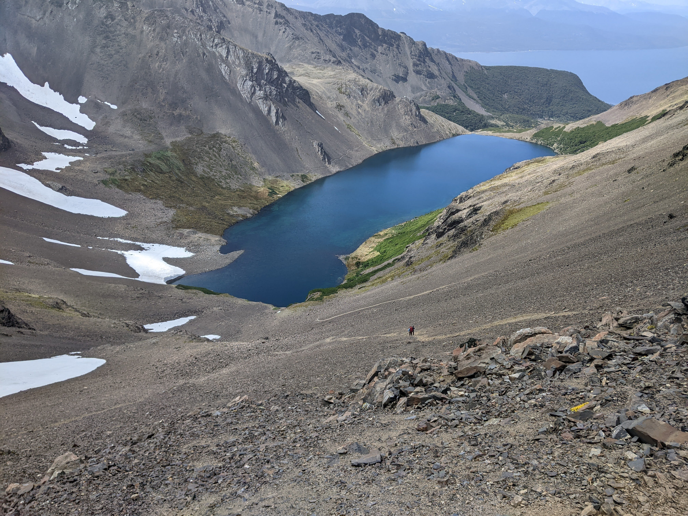
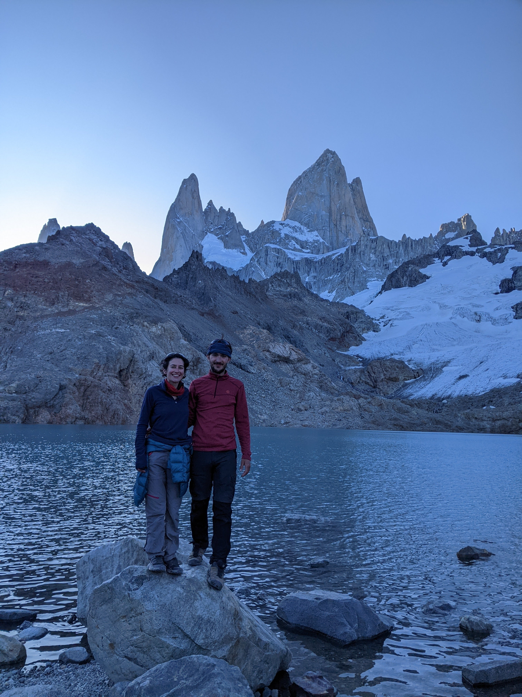
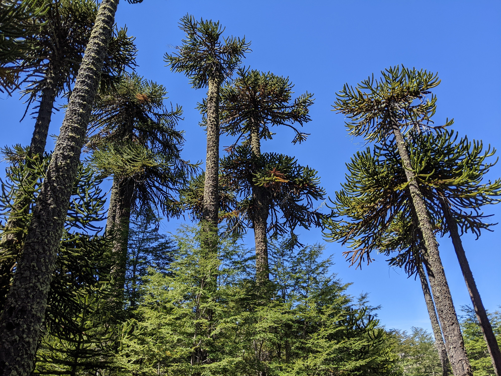
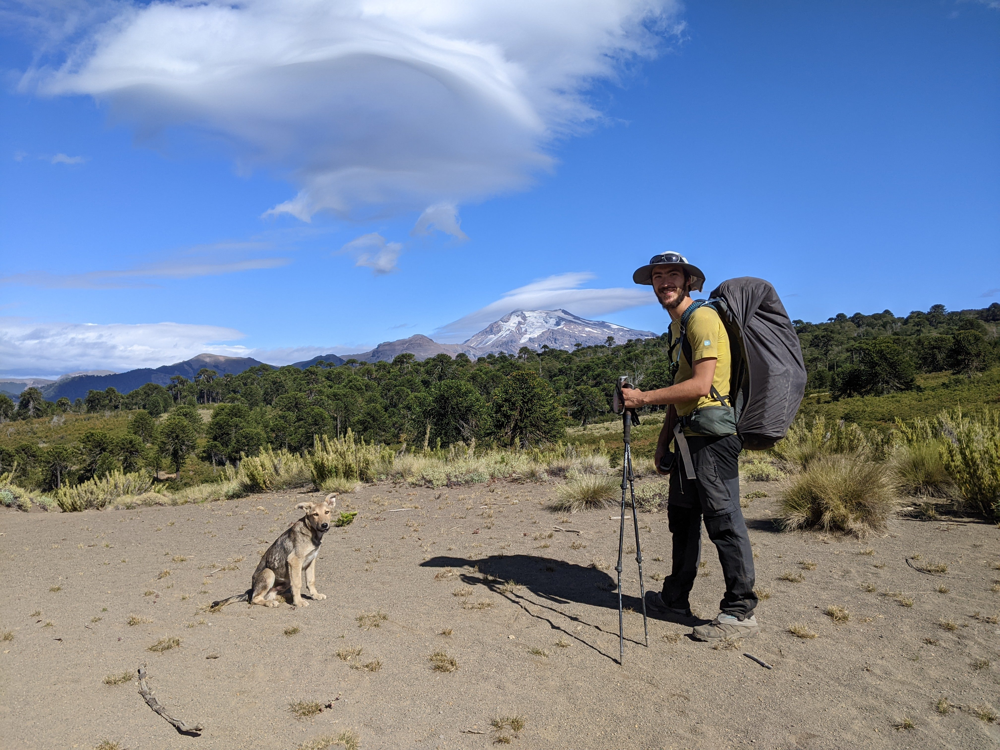
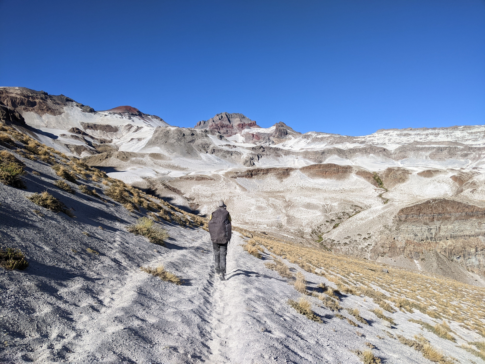

# The Hike

!!! note "Disclaimer"

    This page simply relates our experience on the section we hiked. For up to date informations, the Wikiexplora and the Manual are much better sources.

??? example "Data sources"
    All distances measures are from our Garmin Etrex 32X tracks, but the elevation numbers were computed using the Google Elevation API.

## GPT67

* **Name**: GPT67
* **Length**: 81 km
* **Elevation**: 4036 m D+ / 3857 m D-
* **Hiking time**: 28 h

Our first hike on the GPT was the southernmost hike in the world! It was also one of the most challenging hikes we have done, and we had to change our plans because we were unable to progress on the terrain. This loop is well-known as the Dientes Circuit, but the GPT Regular Route takes a slightly longer option by going with the Lago Winhond deviation. This part of the trail was not well-maintained and ended up being very challenging. There was also a steep descent on scree at the end of the hike that we found really scary. However, we were lucky because the weather was clement.

<figure markdown>
  { loading=lazy width=24% data-gallery="GPT67"}
  { loading=lazy width=24% data-gallery="GPT67"}
  { loading=lazy width=24% data-gallery="GPT67"}
  { loading=lazy width=24% data-gallery="GPT67"}
</figure>

## GPT45

* **Name**: GPT45
* **Length**: 85 km
* **Elevation**: 2401 m D+ / 2402 m D-
* **Hiking time**: 20 h

Hiking in Torres del Paine requires more planification that we had, so we only found space in one camping there (Grande Paine). We thus hiked part of the W-trek as day-trips, returning to our camping everynight. This park is really beautiful, but a bit overrun. Of note, the path to enter the park from "administration" is said to be closed in summer, but it is tolerated to hike it.

<figure markdown>
  { loading=lazy width=32% data-gallery="GPT45"}
  { loading=lazy width=32% data-gallery="GPT45"}
  { loading=lazy width=32% data-gallery="GPT45"}
</figure>

## GPT40

* **Name**: GPT40
* **Length**: 67 km
* **Elevation**: 2808 m D+ / 2795 m D-
* **Hiking time**: 19 h

This section is also known as the Huemul Circuit. This 4-day loop is rather challenging, and we had our most scarry moment of the GPT at the Paso del Viento. However, it is really unique and combine a walk on a glacier, some tyroleans, glaciers views, steep forests... we enjoyed it a lot! The last day is a bit less rewarding as the final kilometers are in an endless field, and then on a road.

<figure markdown>
  { loading=lazy width=13.6% data-gallery="GPT40"}
  { loading=lazy width=24% data-gallery="GPT40"}
  { loading=lazy width=24% data-gallery="GPT40"}
  { loading=lazy width=24% data-gallery="GPT40"}
</figure>

## GPT39

* **Name**: GPT39
* **Length**: 61 km
* **Elevation**: 1589 m D+ / 1471 m D-
* **Hiking time**: 13 h

Our first real thru-hikes as the previous hikes were loops. This is also the best attractivity/difficulty ratio of the GPT with a stunning 5/1. While we were definitely not alone (we camped with hundred of other tents), the hike was really beautiful and indeed, extremely easy. We climbed up to Lago Dos Tres for the evening, which allowed us to avoid the crowd and reward us with beautiful evening lights over the Fitz Roy at the lake (where we brushed our teeths ;)). 

<figure markdown>
  { loading=lazy width=32% data-gallery="GPT39"}
  { loading=lazy width=18% data-gallery="GPT39"}
  { loading=lazy width=32% data-gallery="GPT39"}
</figure>

## GPT38

* **Name**: GPT38
* **Length**: 49 km
* **Elevation**: 1818 m D+ / 2015 m D-
* **Hiking time**: 15 h

This hike in the no-man lands between Argentina and Chile was great and was the first one we met almost nobody (we just saw a single tent in 4 days). Truely remote, not super difficult and with a great diversity of landscapes. Of note, the border control at the Argentinian side is a paradise spot for camping.

<figure markdown>
  { loading=lazy width=32% data-gallery="GPT38"}
  { loading=lazy width=32% data-gallery="GPT38"}
  { loading=lazy width=32% data-gallery="GPT38"}
</figure>

## GPT37

* **Name**: GPT37
* **Length**: 68 km
* **Elevation**: 3150 m D+ / 3128 m D-
* **Hiking time**: 20 h

Instead of doing the full section, we opted for the West Traverse and arranged a bot transfer to Bahia Pescada. Afterwards, we thought a faster and cheaper option would have been to resupply at the camping of Candela Mancila and take the boat directly from there. Then, we started hiking northbound until Villa O'Higgins. We met exactly 0 other human being in these 4 days, and hiked on barely hiked trails. Eventhough the navigation was sometimes challenging, this was a really great experience.

<figure markdown>
  { loading=lazy width=24% data-gallery="GPT37"}
  { loading=lazy width=24% data-gallery="GPT37"}
  { loading=lazy width=13.6% data-gallery="GPT37"}
  { loading=lazy width=24% data-gallery="GPT37"}
</figure>

## GPT32

* **Name**: GPT32
* **Length**: 55 km
* **Elevation**: 2893 m D+ / 2451 m D-
* **Hiking time**: 15 h

We did only a part of the 32, also known as La Horquetas, in the National Park Cerro Castillo. While the entrance is expensive, the hike in itself is rather nice and diverse with stunning landscapes. We also enjoyed going up to the different lakes.

<figure markdown>
  { loading=lazy width=24% data-gallery="GPT32"}
  { loading=lazy width=24% data-gallery="GPT32"}
  { loading=lazy width=24% data-gallery="GPT32"}
  { loading=lazy width=24% data-gallery="GPT32"}
</figure>

## GPT19

* **Name**: GPT19
* **Length**: 57 km
* **Elevation**: 3005 m D+ / 2834 m D-
* **Hiking time**: 17 h

One of our favorite hike of the GPT, truely an amazing one. That was also our first ascencion of a volcano and we were rewarded with unique views on the crater. While the hike begins in a forest, it is then walking without paths in the middles of volcanic dunes, without shade or water, running when going down and struggling when going up. We were rewarded from this dry crossing with a hot river at the end where we met a group of tourists with horses, that invited us to share their campfire. And a final day in a foggy forest that achieved an impressive diversity of landscapes.

<figure markdown>
  { loading=lazy width=24% data-gallery="GPT19"}
  { loading=lazy width=24% data-gallery="GPT19"}
  { loading=lazy width=24% data-gallery="GPT19"}
  { loading=lazy width=24% data-gallery="GPT19"}
</figure>

## GPT16

* **Name**: GPT16
* **Length**: 50 km
* **Elevation**: 2404 m D+ / 2149 m D-
* **Hiking time**: 13 h

After a break due to the huge forest fires, we restarted our GPT adventure on the section 16. We loved it! The volcan crater, the nice mountain lakes, and the end on the Villarica traverse were both really accessible, and enjoyable.

<figure markdown>
  { loading=lazy width=13.6% data-gallery="GPT16"}
  { loading=lazy width=24% data-gallery="GPT16"}
  { loading=lazy width=13.6% data-gallery="GPT16"}
  { loading=lazy width=24% data-gallery="GPT16"}
</figure>

## GPT12
* **Name**: GPT12
* **Length**: 103 km
* **Elevation**: 4590 m D+ / 4235 m D-
* **Hiking time**: 28 h

We combined GPT12 to GPT09 in one stretch. The first part, on the 12, is probably the most beautiful of the stretch. It is a succession of highlights. We also had the chance to spend a night with a traveling arriero along a warming fire, to taste our first piñones and to share an asado with a group of tourist in the cordillera before taking a hot bath in the middle of nowhere.

<figure markdown>
  { loading=lazy width=32% data-gallery="GPT12"}
  { loading=lazy width=32% data-gallery="GPT12"}
  { loading=lazy width=32% data-gallery="GPT12"}
</figure>

## GPT11
* **Name**: GPT11
* **Length**: 34 km
* **Elevation**: 1342 m D+ / 1776 m D-
* **Hiking time**: 9 h

This section was really short. It started in a river bank that we used to go up for hours. This exhausting climb is rewarded by stunning views on the mountains, and the rest of the section is really straightforward. 

<figure markdown>
  { loading=lazy width=32% data-gallery="GPT11"}
  { loading=lazy width=32% data-gallery="GPT11"}
  { loading=lazy width=32% data-gallery="GPT11"}
</figure>

## GPT10
* **Name**: GPT10
* **Length**: 52 km
* **Elevation**: 1549 m D+ / 1546 m D-
* **Hiking time**: 11 h

Another short section without major difficulties. We were joined in this section by a dog found near Laguna Barco that followed us for two days before we had to leave him in Trapa Trapa. The plateau, at the beginning of the hike, was stunning! Then, in Trapa Trapa, we stayed with a family and shared with them sopapillas, soup, drawings and how to build origamis.

<figure markdown>
  { loading=lazy width=32% data-gallery="GPT10"}
  { loading=lazy width=18% data-gallery="GPT10"}
  { loading=lazy width=32% data-gallery="GPT10"}
</figure>

## GPT09
* **Name**: GPT09
* **Length**: 71 km
* **Elevation**: 3058 m D+ / 3181 m D-
* **Hiking time**: 18 h

A short section starting with a smooth ascent in the forest, a nice vallee, and the Volcano Antuco! Climbing up is hard, but the small crater at the top and the beautiful views on Laguna Laja make it completely worth it.

<figure markdown>
  { loading=lazy width=24% data-gallery="GPT09"}
  { loading=lazy width=24% data-gallery="GPT09"}
  { loading=lazy width=24% data-gallery="GPT09"}
  { loading=lazy width=13.6% data-gallery="GPT09"}
</figure>

## GPT08

* **Name**: GPT08
* **Length**: 117 km
* **Elevation**: 5990 m D+ / 5090 m D-
* **Hiking time**: 30 h

After a ressuply break in Los Angeles (24h), we started section 8. This section was still great, but we were a bit tired by the previous stretch. Instead of finishing the section with the RR, we decided to climb Chillan and to exit at the Thermas de Chillan. This allowed us to shorten the route by a couple of days. Nonetheless, we loved our hot springs: both at Thermas de Peucos, and near Aguas Caliente.

<figure markdown>
  { loading=lazy width=24% data-gallery="GPT08"}
  { loading=lazy width=24% data-gallery="GPT08"}
  { loading=lazy width=24% data-gallery="GPT08"}
  { loading=lazy width=24% data-gallery="GPT08"}
</figure>

## GPT06

* **Name**: GPT06
* **Length**: 92 km
* **Elevation**: 5534 m D+ / 5824 m D-
* **Hiking time**: 26 h

Our last section on the GPT, and arguably the best one. Instead of starting from Los Cypres, we rented horses in Vilche until Rio Blanquilo. This allowed us to experience the GPT's trails a bit more with the way of locomotion it was made for. Then, we did the Descabezado ascent, starting at 2AM in the cold night! This 2000m climb was exhausting but the morning lights at the top and the breakfast watching the ice in the crater made it worthwile. Finally, the hike finished by some hot springs in Termas de Azufre after a day in the white sand, and with a trail in a forest.

<figure markdown>
  { loading=lazy width=24% data-gallery="GPT06"}
  { loading=lazy width=24% data-gallery="GPT06"}
  { loading=lazy width=24% data-gallery="GPT06"}
  { loading=lazy width=24% data-gallery="GPT06"}
</figure>

## Bonus: Ruta Tantauco

* **Name**: Ruta Tantauco
* **Length**: 96 km
* **Elevation**: 1290 m D+ / 1450 m D-
* **Hiking time**: 27 h

Because of the fires, we had to do a small break in our GPT exploration. After looking at alternatives, we decided to visit Chiloe and hike in the (private) Parque Tantauco. This trail of 94km in the wetland of Chiloe was beautiful, and not like any other sections of the GPT. First, it had a lot of infrastructures on the trail, a refugio with a stove everynight, and a mark every 50m with the actual kilometers count. As the steps were forced and not excessively long (between 7 and 15 kilometers), we really enjoyed our afternoons near the fire reading and resting.

<figure markdown>
  { loading=lazy width=13.6% data-gallery="RT"}
  { loading=lazy width=24% data-gallery="RT"}
  { loading=lazy width=13.6% data-gallery="RT"}
  { loading=lazy width=24% data-gallery="RT"}
</figure>
