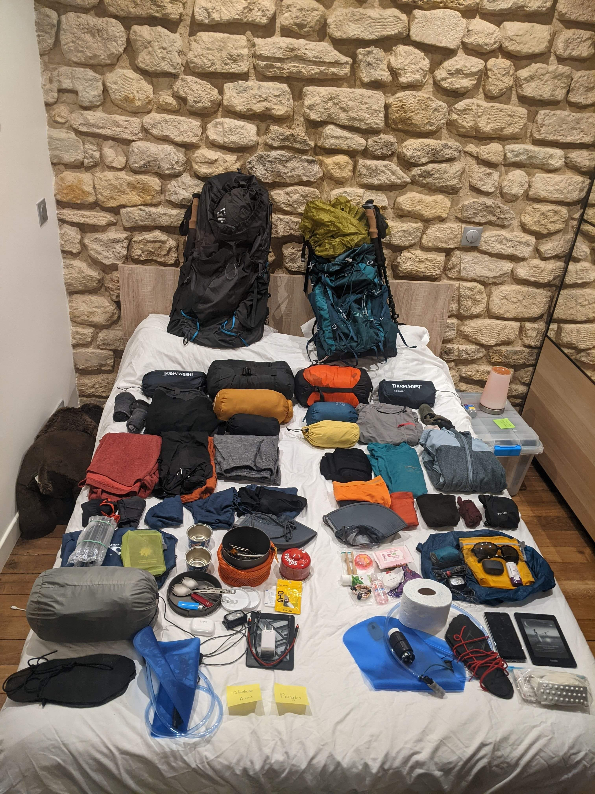
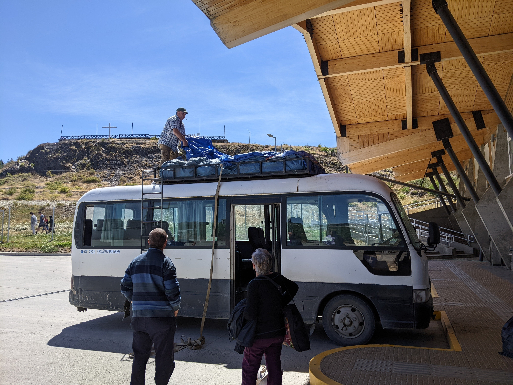
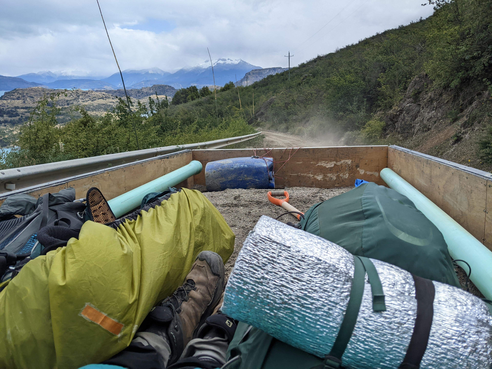
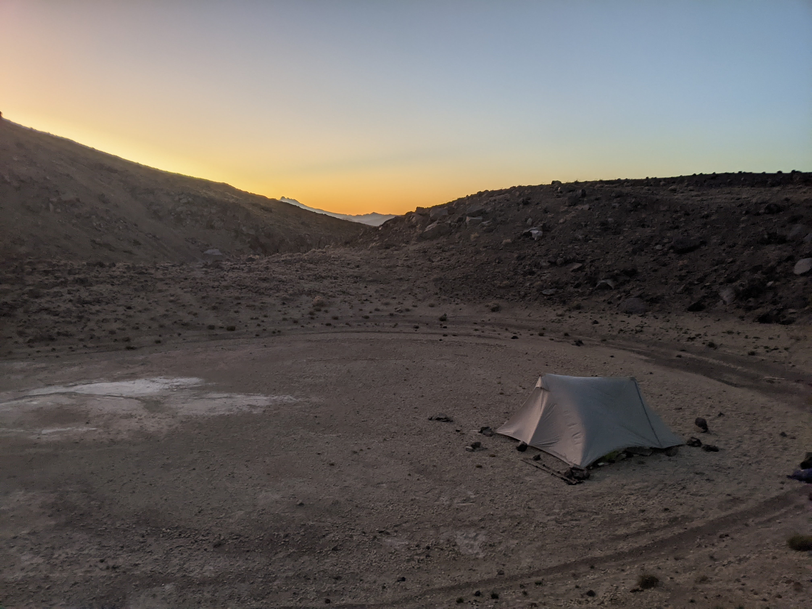
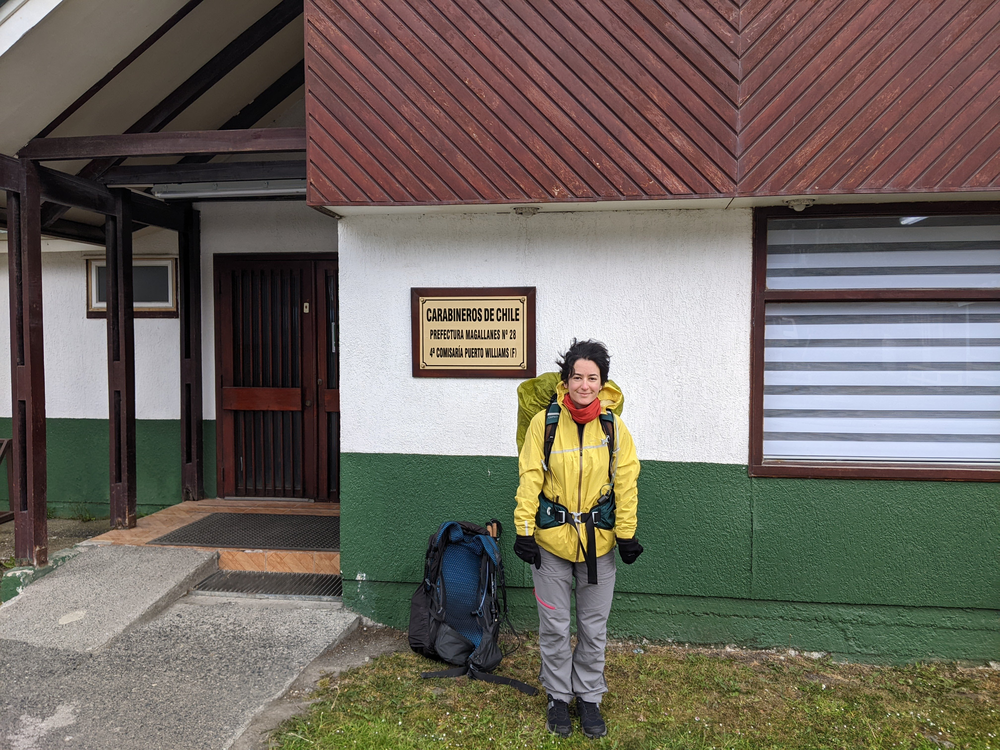
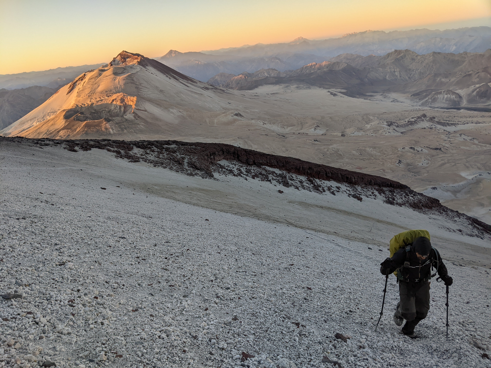
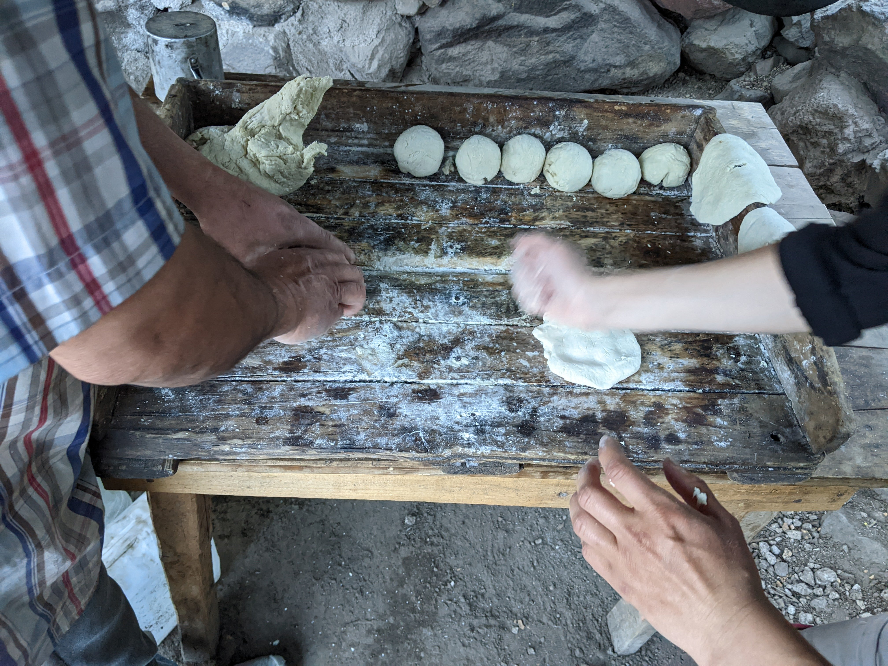

# Planning & Logistics

In this page, we detail some details on how we prepared and hiked our GPT. We hope that this could be valuable to future GPT hikers but everyone will have different experiences.

## The Manual and Wikiexplora

This 1,000-page PDF [document](http://bit.ly/GPTguide) has been tremendously helpful for us during our GPT hike. We not only read it before leaving to help us plan our hike and understand what to pack, but also referenced it during the hike. It is worth noting that most of our trail discoveries were actually already present in the manual. (Even when we discovered that crispy onions make a really tasty and light addition to most of our trail meals, that was already written in the manual). We often jokingly referred to the manual as "Our Bible," but we cannot overstate how useful it has been to us.

The [Wikiexplora](https://www.wikiexplora.com/Greater_Patagonian_Trail) was also a very precious source of information that we preciously read on the trip, ahead of planning each section.

## Before leaving

### Getting the tracks

To embark on the GPT, it's essential to obtain the GPX tracks. Although we encountered a fellow hiker on GPT16 who relied solely on the inaccurate version found on Wikiloc, we would have felt uncomfortable doing this. For example, this individual had no knowledge of the water sources in the desert section.

To acquire the tracks, follow the instructions outlined in the manual. We are grateful Jan took the time to chat with us before sharing the tracks. We found his advice invaluable.

As explained in the manual, the GPT is not a single trail, but rather a vast network of trails, spanning over 5,000 kilometers and divided into approximately 90 sections (as of 2023), and attempting to thru-hike the entire length in one season would be extremely challenging and dangerous, so it's important to plan accordingly.

### Planning

When we initially set out, we didn't have a well-defined plan because we weren't entirely sure what we were capable of. Our initial goal was to start with GPT67 and then decide where to go from there. We chose to begin at the southernmost point of the continent and gradually make our way north. Despite the lack of a detailed plan, we found that this approach gave us the freedom to enjoy the trail at our own pace.

### Gear List

<figure markdown>
  { loading=lazy width=80% data-gallery="index"}
  <figcaption>Our gear laying on the bed before departure</figcaption>
</figure>

Something that was crucial for us before leaving was to have an optimised gear list (and we became a bit obsessed with that). Since we knew we would be carrying our backpacks every day, we aimed for something close to ultralight. However, since we had to use these backpacks for an entire year, we had to make compromises with some items. For example, while earphones were not necessary for the hike itself, they were a nice addition for the long bus rides.

Looking back, we used all of our items and were quite content with the contents of our backpacks. Having lightweight backpacks allowed us to carry up to 12 days worth of food for the longer stretches, which was incredibly helpful.

We describe more in details our gear list in [this page](gear.md).

## In South America

### Bus

<figure markdown>
  { loading=lazy width=80% data-gallery="index"}
  <figcaption markdown>The (subsidised) _collectivo_ from Villa O'Higgins to Cochrane</figcaption>
</figure>

We extensively used the bus network to travel between the sections of the GPT. It was both affordable and reliable. However, getting the schedules of the smaller buses could be difficult.

When traveling from a big city to another big one or a smaller one, we simply went to the first bus terminal and asked when the next departure was. We were rather lucky and always got a bus without waiting much.

When traveling from a small city to a bigger one, we followed the same strategy. We went to the bus terminal or asked the locals where the buses would leave. However, sometimes even they struggled with the schedules. We often had to resort to hitchhiking, especially on Sundays. Sometimes social media could provide useful information. For instance, we found a WhatsApp group in Antuco that was used to share bus schedules between its members.

For travels between two small cities, we usually did not try. Our travels between sections always went back to the main road. There are probably shorter options by staying in the secondary road network, but we did not explore them.

<figure markdown>
  { loading=lazy width=80% data-gallery="index"}
  <figcaption>Hitchhiking in a pickup truck is awesome as you have the best views!</figcaption>
</figure>

We had no trouble hitchhiking, especially on minor roads. In our experience, the fewer cars there were, the more likely they were to take us. Some even went the extra mile (quite literally) by dropping us off further than their planned route.

### Ressuply

Our approach to resupplying on the trail differed depending on whether we were in the South or the North. South of Puerto Montt, we only came across smaller supermarkets (Unimarc were the biggest one), so we had to make do with whatever we could find to create our trail meals.

<figure markdown>
  { loading=lazy width=80% data-gallery="index"}
  <figcaption>Lider logo (the local Walmart)</figcaption>
</figure>

However, once we reached Puerto Montt, we started targeting the Lider supermarket (the local equivalent of Walmart). Lider is well established in Chile, reasonably priced, and has a good selection of options (although not as much as Jumbo). By only shopping at the same brand of supermarket, we were able to be more efficient while grocery shopping and we even developed some food preferences (such as our love for the crunchy peanut butter!).

For more information on our meals and hiking food, please refer to the [dedicated page](food.md).

### Housing (iOverlander)

<figure markdown>
  { loading=lazy width=80% data-gallery="index"}
  <figcaption>Our camping spot near Volcán Quetrupillán</figcaption>
</figure>

Finding a camping spot on the trail is not difficult. Indeed, Jan (and the other contributors) made a tremendous work and the tracks are filled with Camp/Camp NO water points which are suitable for camping. Of note, they do not represent all the possible locations for camping. In trail towns, finding an appropriate camping spot can be a bit more challenging. To help us out, we used the collaborative application [iOverlander](https://www.ioverlander.com/), which lists spots for both vans/campers and tents. We had some success using this app to find suitable camping spots.

### Carabineros

<figure markdown>
  { loading=lazy width=80% data-gallery="index"}
  <figcaption>Iris in front of the Cariberineros Office in Puerto William. For this section, the registration is mandatory.</figcaption>
</figure>

The Carabineros were also a highlight of our trip. For some sections, registration was mandatory (like in GPT67), but for others, we spontaneously went to greet them. They know the cordilleras well and gave us valuable advice on the trail. More importantly, they were also extremely friendly, offering to refill our bottles and suggesting appropriate camping spots in small towns along the way. We were positively surprised by their behavior!

### Navigation

<figure markdown>
  { loading=lazy width=80% data-gallery="index"}
  <figcaption>A navigation device is useful because sometimes there is no path. This photo was taken during the ascent of Descabezado Grande in GPT06.</figcaption>
</figure>

As highlighted in the guidebook, navigation on the GPT can be challenging. We were used to European (French) trails with regular markings and easy-to-follow paths. However, on the GPT, some sections are not as straightforward. While it can be enjoyable at times (like on GPT19, where we enjoyed running over the dunes while following the GPS directions), it can also be mentally exhausting to constantly check the GPS to find the correct direction or understand the track. Our worst experiences were not when there was no trail at all, but when we had several options and didn't know whether to follow the track closely or go with the flow.

### Speaking Spanish

<figure markdown>
  { loading=lazy width=80% data-gallery="index"}
  <figcaption>Learning how to do sopaipillas with Umberto, an arriero encountered during GPT06.</figcaption>
</figure>

During our GPT hike, we did not come across many, if any, English speakers. While Iris had taken some Spanish lessons during her studies, Alexis had never learned the language. This language barrier proved to be a challenge, and he felt like he was missing out. Interactions with locals, which were some of the highlights of the hike, were limited for him. This was especially difficult in the South, where the accents were stronger. Looking back, we wish we had improved our Spanish proficiency before embarking on the hike, as it would have allowed us to fully enjoy the experience.

### Electricity

Our GPS device (Garmin Etrex 32X) runs on batteries, so we made sure to purchase them during our resupplies. Luckily, they were widely available. After having a bad experience with batteries from an unknown brand, we decided to stick with Duracell.

Initially, we didn't have an external power bank, so we had to manage our smartphone batteries carefully. We kept one phone switched off and used the other for taking pictures. We minimized our phone usage as much as possible, only using the camera and Locus to get an overview of the trail. With the ultra-energy saver mode on Android, it took about 4 to 5 days to completely drain a battery.

We finally bought an external battery as a backup for the 12-9 stretch, but we never needed it.

### Pharmacy

While taking advice from the center of international medicine in Saint Louis Hospital (Paris) and doctors in our surroundings, we tried to constitute a relatively lightweight pharmacy. We made the hypothesis that we would always be at max 3 days walking distance from a town or village, and hence we took only what we thought was the very first aid necessity. This implied we never engaged in a section if we felt some weaknesses or doubts about our health/body.

We had some pain killers (10\*1g Paracetamol, and 7\*50mg Tramadol for heavier pains), material for wounds (10 cm of bandage to cut, 4 sterilized pads, 10 strips, 1 reusable cotton and a 50ml disinfectant), a medicine against heavy diarrhea (20\*100mg Tiorfan), and a morning-after contraceptive pill.
We also had a little tube of corticoid in case of insect stings, but we forgot we had it until it broke and splashed in our pharmacy.

We were lucky we never had to use our pharmacy during our walk, it served only to give pain killers to an arriero met on the way. But we were quite happy with what we carried for the context of the GPT.

### Toilets

In the nature, we used our pee-rags (sewed by Iris before leaving) to keep our underwear clean longer. They allow to clean the last drop. For poop, we almost never carried toilet paper but used a small water bottle to clean ourselves (carried empty but water can be found often on the trail).
We thought the combination of both the pee rag and the small bottle were weight efficient, hygienic, and comfortable. And more importantly, zero waste.
